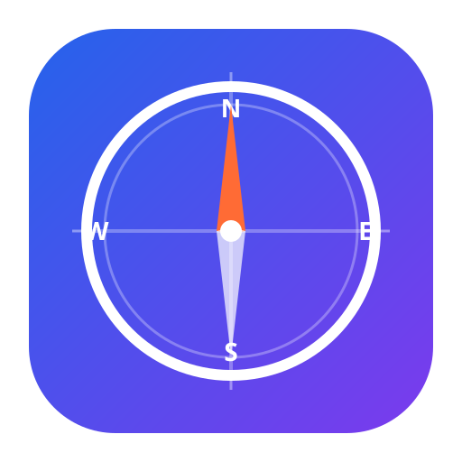

# WebNav — 桌面网页链接管理器

> 基于 C++ / Qt 6 的桌面网页链接管理器
> 双视图可切换 · 拖拽排序 · 链接账密存储 · 可扩展云端同步



## 项目状态

✅ **Phase 1 核心体验完成** — 模块化构建，约 4000+ 行代码，完整交互闭环

### 已完成的模块

| 模块 | 说明 |
|------|------|
| ✅ 项目骨架 | CMake 构建系统、分层目录结构、Git 版本管理 |
| ✅ 数据模型 | Link / Folder / Tag / LinkField 纯数据结构 |
| ✅ 数据库层 | SQLite + Repository 接口抽象 + CRUD 完整实现 |
| ✅ 核心服务 | CryptoService(DPAPI加密)、FaviconService、书签导入导出、死链检测 |
| ✅ UI 组件 | Sidebar(文件夹树+标签列表)、SearchBar、TagSelector、FieldEditor |
| ✅ 双视图 | 列表视图(Ctrl+1) + 卡片视图(Ctrl+2)，内置拖拽排序 |
| ✅ 对话框 | LinkEditDialog(含附加字段+时间信息)、SettingsDialog、AboutDialog |
| ✅ 主窗口 | 工具栏(新建/编辑/打开/删除)、快捷键、状态栏、视图切换 |
| ✅ 应用层 | Application 初始化、主题加载、SVG 应用图标 |
| ✅ 工具类 | 跨平台打开浏览器、颜色/图片工具 |

## 环境要求

- **Qt**: 6.5+（需要 Core, Widgets, Sql, Network 模块）
- **CMake**: 3.20+
- **编译器**: MSVC 2022 / MinGW 11+ / GCC 11+
- **构建**: Qt WebEngine（Phase 2 预览面板需要）

## 快速开始

```bash
git clone https://github.com/yourusername/WebNav.git
cd WebNav
mkdir build && cd build
cmake .. -DCMAKE_PREFIX_PATH=/path/to/Qt6/6.x.x/mingw_64
cmake --build . --target WebNav -- -j8
./src/WebNav.exe
```

## 功能特色

- **双视图浏览**: 列表视图和卡片视图一键切换 (Ctrl+1 / Ctrl+2)
- **拖拽排序**: 列表视图中直接拖动行改变链接先后顺序，工具栏 ↑↓↥ 辅助排序
- **批量操作**: 多选后右键批量打开/打标签/移动文件夹/删除
- **文件夹管理**: 无限层级树形分类，右键菜单支持新建/重命名/删除
- **标签系统**: 彩色标签筛选（可点击选中/取消选中），右键可删除标签
- **鼠标交互**:
  - 单击 → 选中
  - 双击 → 编辑链接
  - 右键 → 上下文菜单（打开/编辑/复制URL/删除 + 批量操作）
  - 拖拽 → 重新排序
- **工具栏**: ✏编辑 / 🌐打开 / 🗑删除 / ↑↓↥排序 / ⚙设置
- **菜单栏**: 文件菜单（导入书签/导出书签/关于）
- **附加字段**: 为链接保存账号/密码/邮箱/电话等凭据（密码加密存储）
- **书签导入导出**: 支持 Chrome / Firefox / Edge HTML 导入和导出
- **实时搜索**: 300ms 防抖，搜索标题/URL/备注
- **深色/浅色主题**: 默认深色，设置中可切换为浅色
- **系统托盘**: 关闭窗口最小化到托盘，双击托盘恢复，右键菜单操作
- **失效链接**: 侧边栏 ⚠ 按钮一键筛选失效链接
- **卡片视图**: 自绘制卡片展示标题/域名/标签，自动适配深色/浅色
- **状态栏**: 显示共X条链接 | 选中Y条
- **快捷键**: Ctrl+N 新建 / Ctrl+F 搜索 / Delete 删除

## 快捷键

| 快捷键 | 功能 |
|--------|------|
| `Ctrl+N` | 新建链接 |
| `Ctrl+F` | 搜索框聚焦 |
| `Ctrl+1` | 列表视图 |
| `Ctrl+2` | 卡片视图 |
| `Delete` | 删除选中链接 |
| `双击` | 编辑链接 |
| `右键` | 上下文菜单 |
| `拖拽` | 重新排序 |

> **注意**: 多选时按住 Ctrl 单击选择多条，右键弹出批量操作菜单（批量打开/打标签/移动文件夹/删除）。

> **注意**: 链接不在主页直接编辑，所有编辑操作通过双击或✏编辑按钮进入对话框完成。打开链接请使用工具栏🌐按钮或右键菜单。

## 相关文档

- [设计文档](design.md) — 完整的设计方案、数据库设计、架构说明
- [开发规范](CONTRIBUTING.md) — 代码风格、工作流程、常见陷阱

## 许可证

MIT
